P14

---
## 反向传播

# Gradient Descent

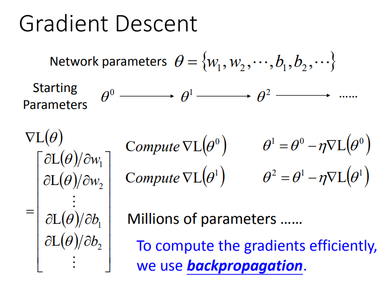

---

#### Chain Rule(链式法则)

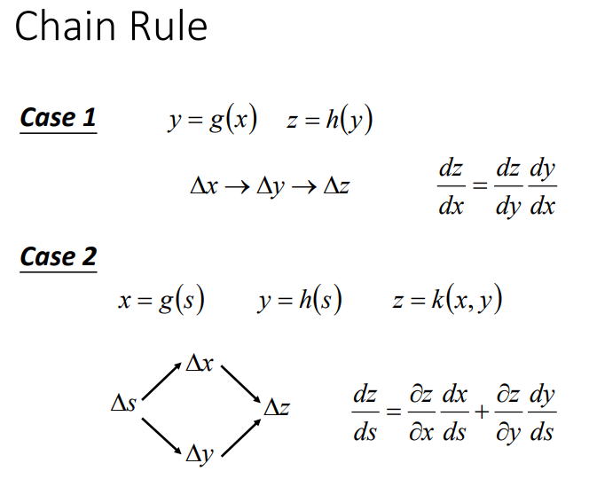

现在回到Backpropagation,先考虑某一个neuron:

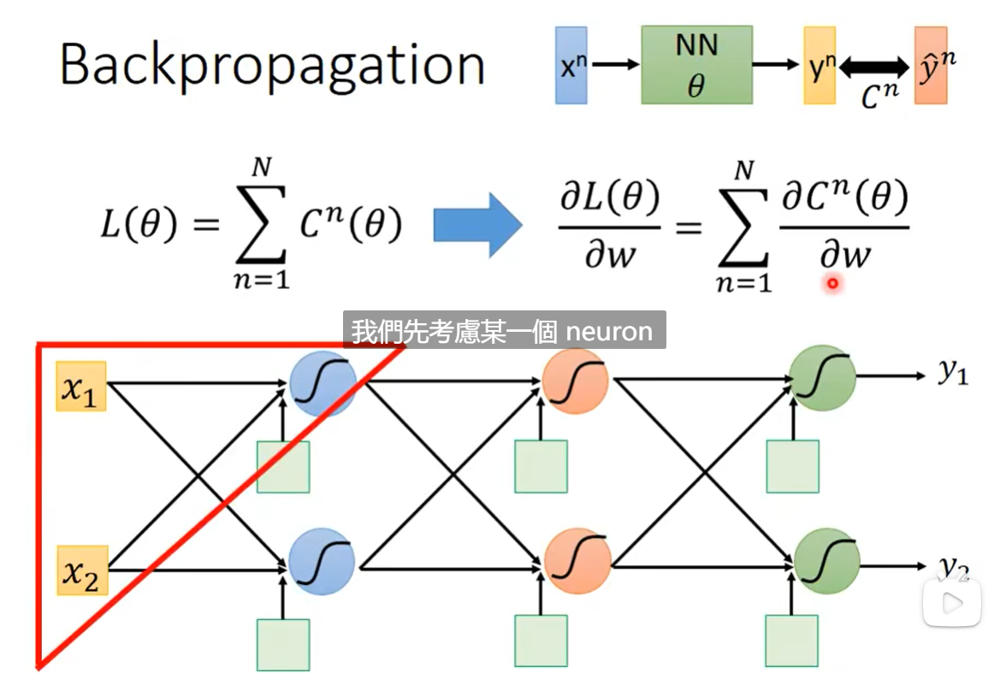

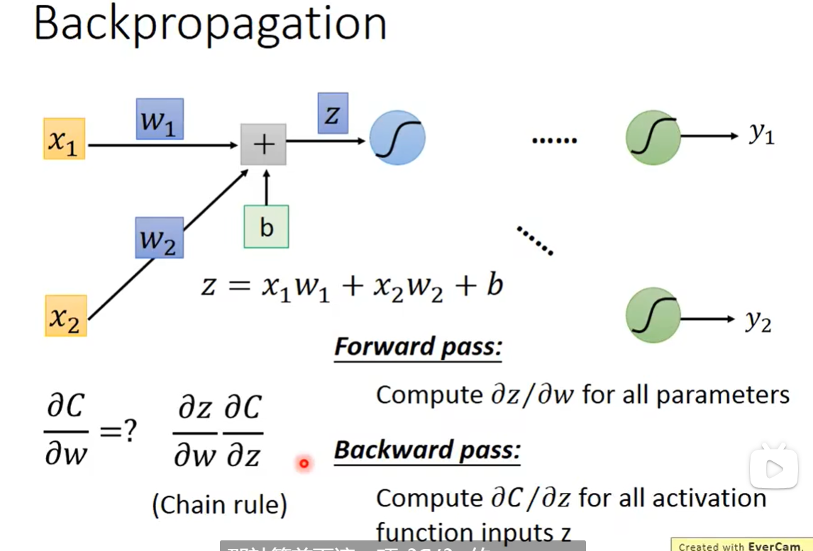

Forward pass: 计算出所有的 **∂z/∂w** 

Backward pass: 对所有的激活函数输入的z计算出所有的 **∂c/∂z** 

最后得到 **∂C/∂w = ∂z/∂w * ∂C/∂z**

---

####  Backpropagation -Forward pass

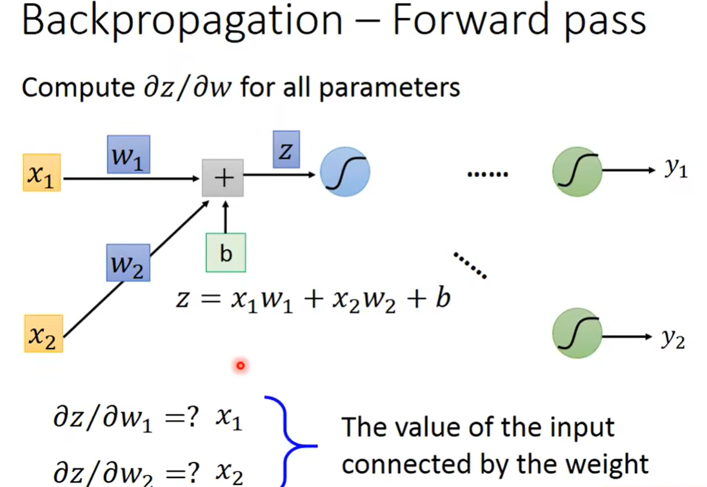

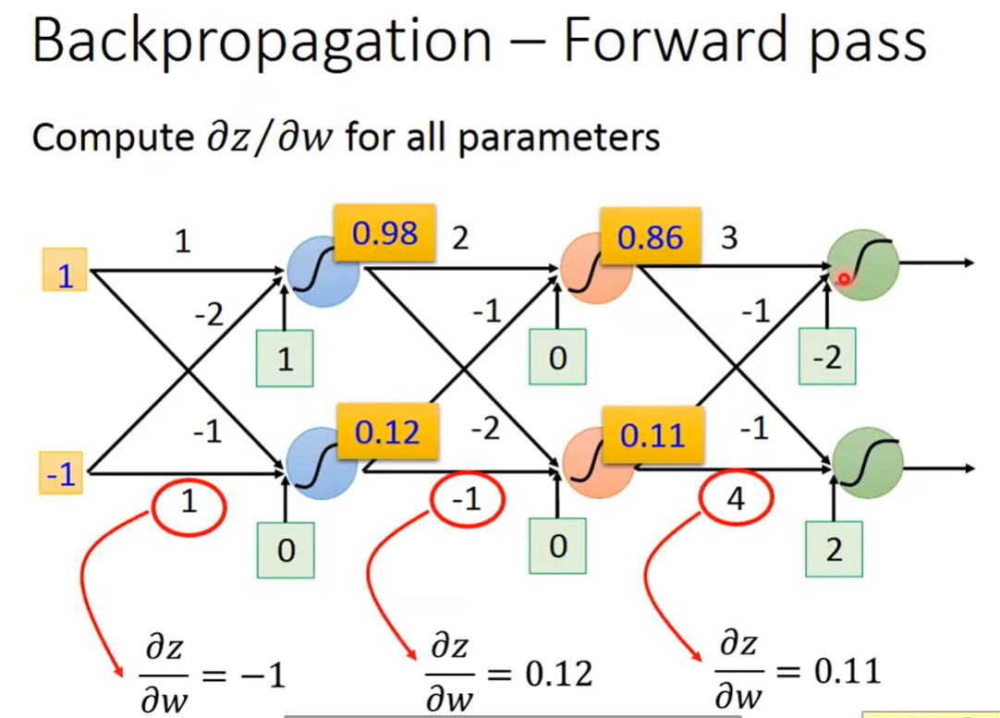

---

#### Backpropagation - Backward pass

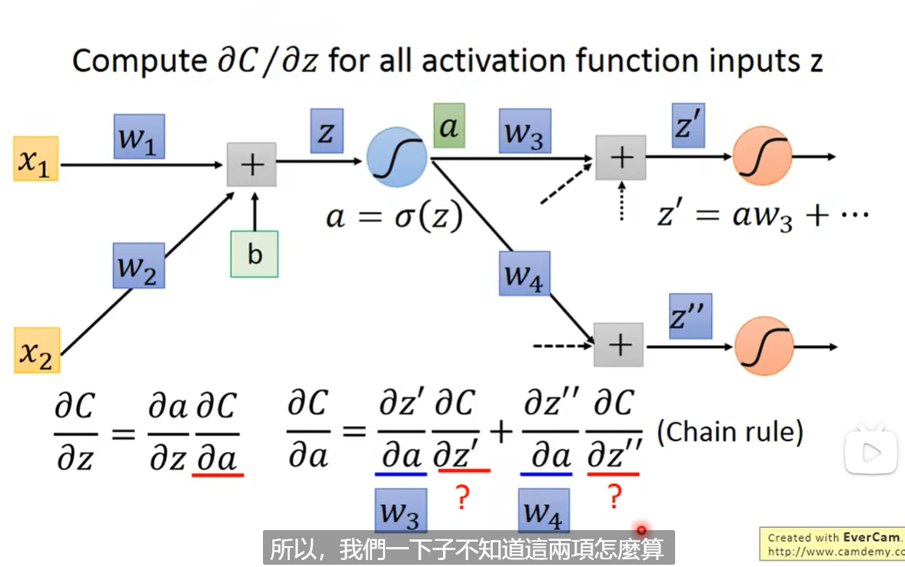

##### ∂c/∂z' 和∂c/∂z'' 怎么算呢, 假设他们已经算出来了

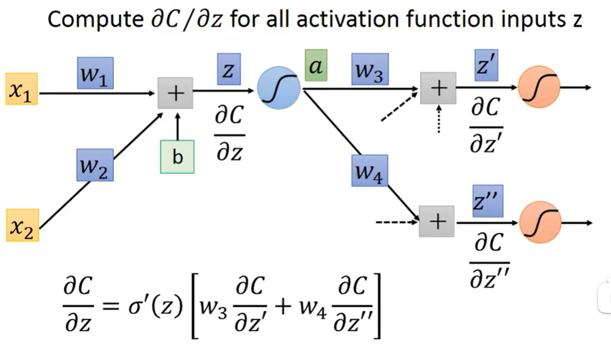

从另外一个视角看待这个式子:

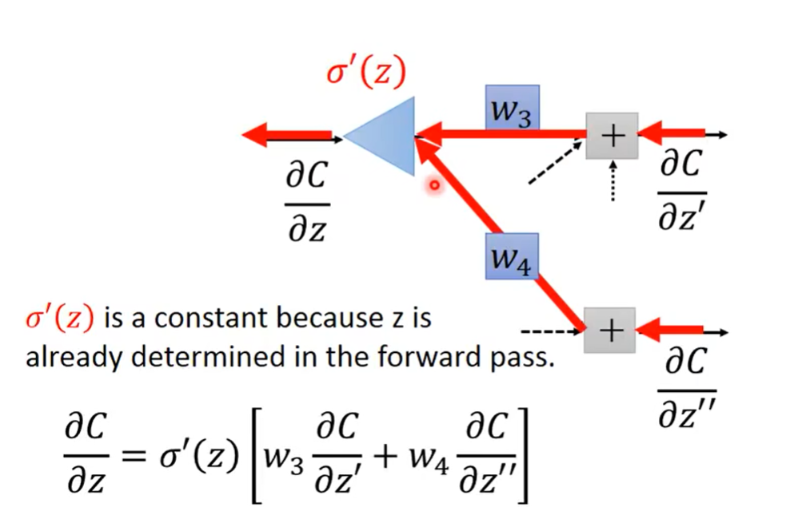

##### 那如何算出∂C/∂z'和∂C/∂z''呢?

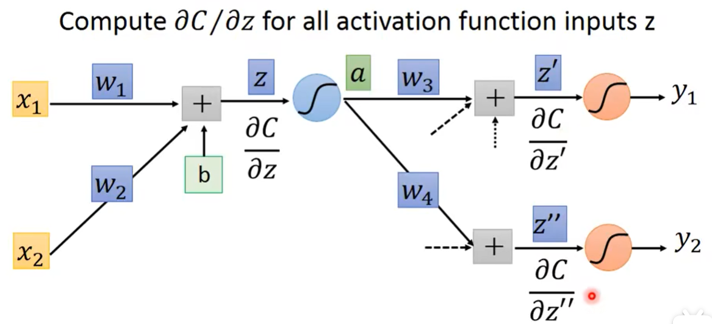

###### Case 1. Output Layer

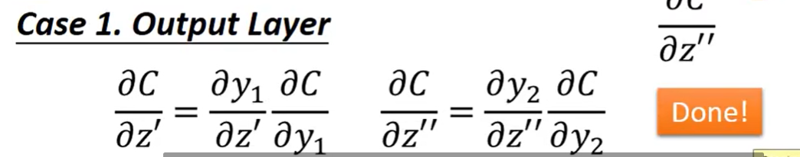

###### Case 2. Not Output Layer

######  溯源到output layer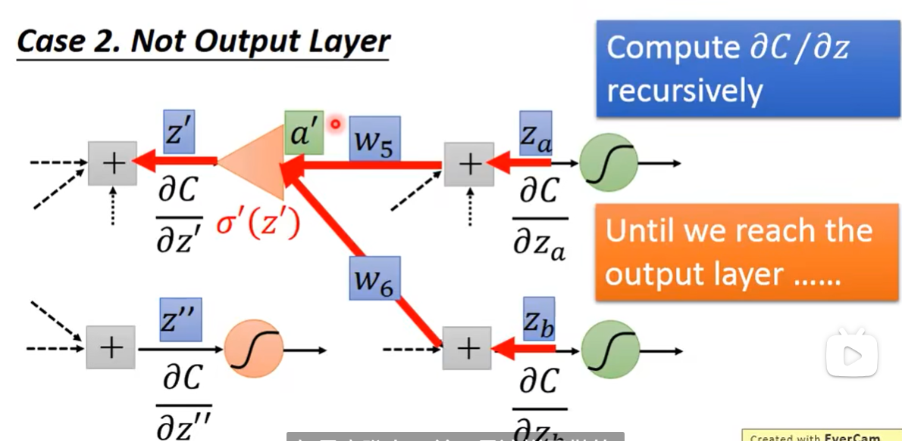

###### actually operation: 

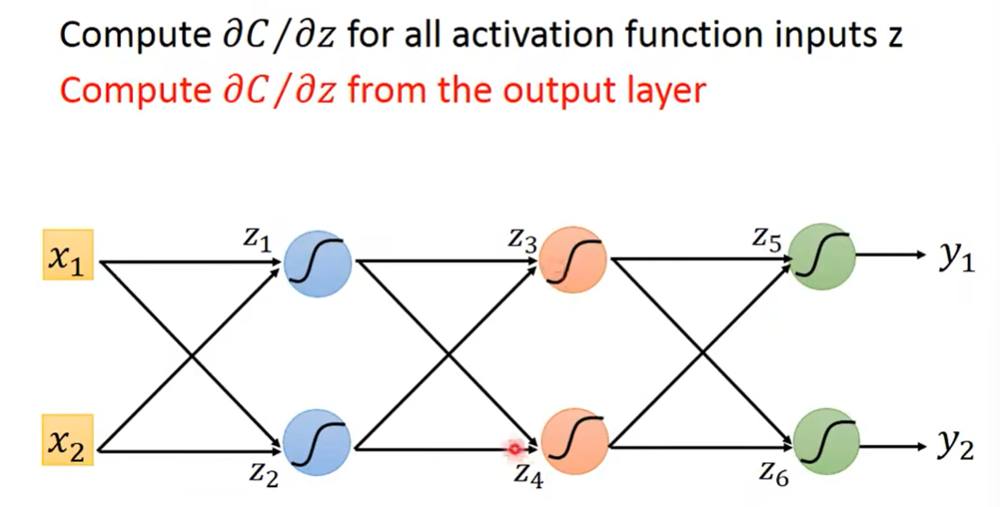

###### 从z5, z6 开始算往前传递:

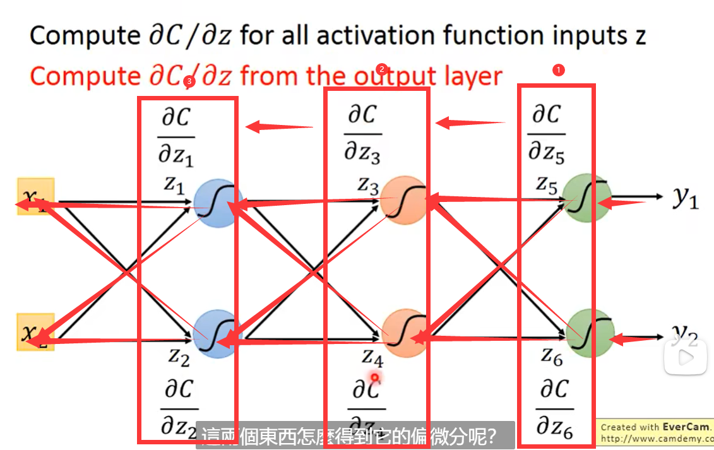

###### 建立反向的神经网络:

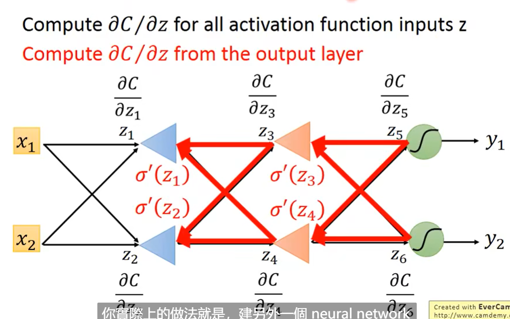

##### Summary:

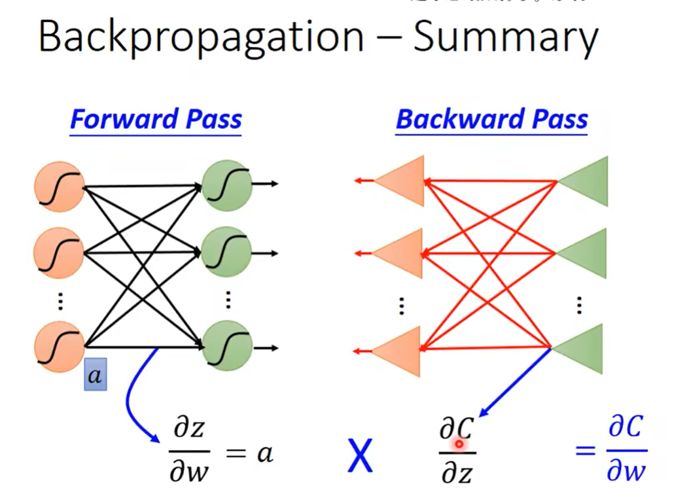

### **∂C/∂w = ∂z/∂w * ∂C/∂z**

