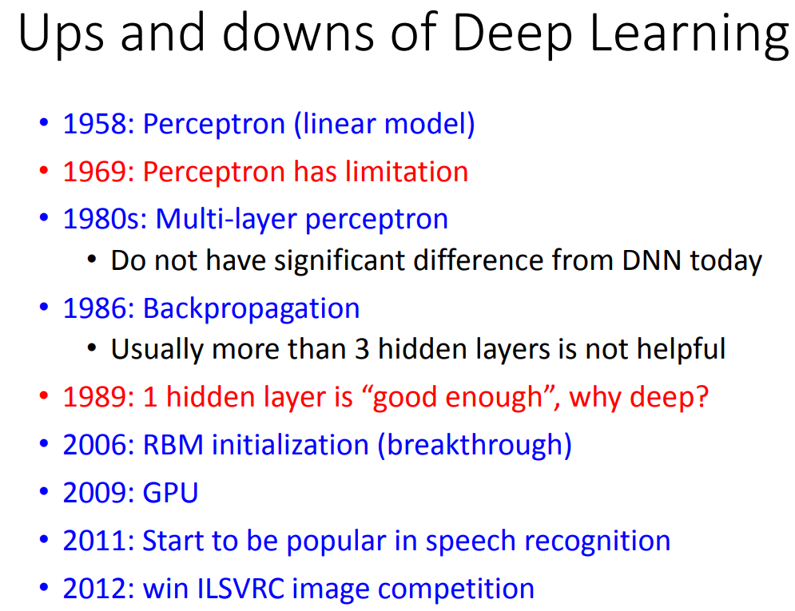

P13

---
## 深度学习
### 发展

### 三个步骤

#### neural network

将多个逻辑回归（一个逻辑回归就是一个神经元）连在一起，就组成了这样的神经网络，不同的连接方式就是不同的网络结构
   
神经网络中的参数 θ ：所有神经元（逻辑回归）中的权重和偏置

全连接网络：每一层所有神经元都与前后层所有神经元相连

对于不知道参数的模型，就是一个可以优化参数、通过损失函数定义来找到最优函数（最优参数）的函数集。

全连接前馈网络结构：网络由输入层、隐藏层、输出层构成

涉及的问题：

1. 要多少个layer，每个layer要多少个neurons： 需要根据经验和不断自己尝试，所以DL让问题从抽取特征变为定义结构。之前很多工作都是关注在如何抽取特征，有DL之后主要是如何构造网络结构。

2. 为什么DL在NLP上的效果并不是很好？ 老师给的猜想是，人对于文本提取特征能力很强，人设计的规则可能就能达到一个比较不错的效果。但是长久而言，DL在NLP里面的应用还是很广阔的。

#### goodness of function

#### pick the best function:Gradient Descent

