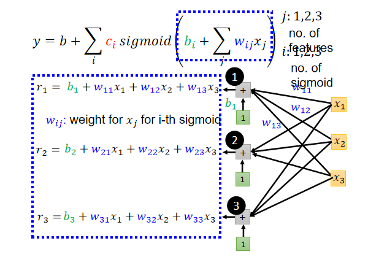
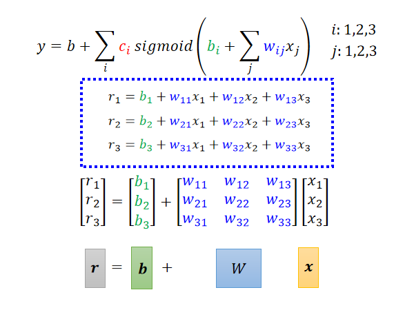

P1-P4, P6, P7, P9-P11

---

##机器学习
### 什么是机器学习？
机器学习就是让机器找一个函数，根据输入，这个函数会输出要得到的结果

|  应用场景举例   | 函数输入  | 函数输出  |
|  ----  | ----  | ----  |
| 语音识别 | 音频 | 文字 |
| 图像识别  | 图片 | 类别 |
| Playing Go  | 当前棋局 | 下一步位置 |

### 机器学习的类别
1. Regression（回归） 
   
         若预测的是连续值，则称为回归。

2. Classification（分类）

         若预测的为离散值，则称为分类。

   让机器做选择题。从设定好的选项里（也就是类别），选择一个当作输出。

3. Structured Learning（结构化学习）
      
         机器在学习的时候不只输出一个数字，不单单做选择题，还要生成有结构的物件。
   也就是让机器学会创造。

**输入输出种类**
1. 输入
   - vector 向量 
   - Matrix 矩阵
   - Sequence 序列
2. 输出
   - regression (数值)
   - classification (分类)
   - text/image

### 机器学习寻找Function的的三个步骤
1. Function with Unknown Parameters（未知参数函数）
               
         写出带有未知参数的函数
假设y=b+w*x，其中b与w是未知的，称为参数（parameter）；而这个带有Unknown的Parameter的Function，称之为Model（模型）

x在这个Function中是已知的，是前一天的后台数据，称之为Feature（特征）；w是与Feature相乘的数，称之为weight（权重）；b没有与feature相乘，称之为Bias（偏离率）。
2. Define Loss from Training Data（定义训练数据的损失函数）

         定义一个Loss（损失函数），Loss也是一个Function，其输入为Model的参数，输出代表了当前输入的参数的值的好坏

定义Loss函数为L(b,w)，损失函数是关于模型中的未知参数的函数，损失函数表示模型预测值和真实值之间的差距。Loss函数可以选择为平均绝对值误差、平均平方误差、交叉熵（y是概率分布时）等，根据对具体任务的要求进行选择。Loss函数值越小表明参数越好。

3. Optimization（最优化）

         找出使得Loss函数最小的未知参数
一般来说，用到的方法就是**Gradient Descent（梯度下降法）**

为了方便，先假设参数只有一个w。

当w的值不同时，对应的Loss的值也不同，这些Loss组成了error surface，由于参数只有一个，则误差曲面也就成为了一维的。

**寻找w的方法**

1.随机选一个初始的点，wº。（不一定完全随机，有选择的方法）

2.计算w=wº时，w对loss的微分是多少，也就是在wº上误差曲面的切线斜率

3.如果误差曲线的左边比较高右边比较低的话，就把w的值变大，就可以让loss变小。如果算出来的斜率是正的，就代表说左边比较低右边比较高，w往左边移，可以让Loss的值变小。

移动w的幅度大小取决于两件事：

1.这个地方的斜率有多大。斜率大，步伐就跨大一点，斜率小步伐就跨小一点。

2.Learning rate（学习速率），令学习速率为η，η是人手动设置的。η的值越大，参数每次update的量就会越大；如果η的值很小，则参数update就会很慢，每次只会改一点点参数的值。（这类需要人手工设置的参数叫做hyperparameters 超参数）

停下来的情况：

1.第一种状况是你自己决定的,做一个deadline，手动决定需要更新几次（超参数）

2.另外一种理想情况，即参数在调整的过程中算出来的微分正好为0时（也就是该点的切线为水平的），参数不会再移动位置了。

但是在梯度下降的这个方法中会遇到global minima（全局最小）的情况，也会遇到local minima（局部最小）的情况，局部最小点的左右两边都比该点的loss还要高一点，但是它不是整个error surface上面的最低点。

以上的例子时参数只有一个的操作流程，可以推广到多个参数。

然而线性模型，x1与y成线性关系，太过简单，有很多局限性；因此我们需要更复杂的模型
### 采用非线性函数表达式得到新模型
Piecewise Linear Curves（分段线性曲线）

不同的w,b,c会形成不同的sigmoid function。当我们改变w时，会改变函式的斜率；改变b会使得函式左右移动；改变c则会改变高度，如下图所示：

红色曲线的函式=0（常数）+1（由c1,b1,w1组成的蓝色function1）+2（由c2,b2,w2组成的蓝色function2）+3（由c3,b3,w3组成的蓝色function3），如下图：

**式子变换过程：**

**得到新模型：**

为什么是折线而不能使用wx+b直线，为什么加偏置？

        当使用直线段时，无法去表示任何一个函数，偏置的增加是为了摆脱中心原点的束缚，使得拟合的函数与原点无关。
**Back to ML_Step 2：define loss from training data** 

定义一个新的Loss

- 先给定某一组W、向量b 、向量cT、数值b 的值，也就是先给定某一组θ的值
- 然后把一种 Feature x 带进去,然后看估测出来的 y 是多少
- 再计算一下跟真实的 Label 之间的差距,得到一个 e
- 把所有的误差通通加起来,就得到 Loss

**Back to ML_Step 3: Optimization** 

同样梯度下降

在实际训练过程中，往往会将训练数据分成很多批（batch），对每一个batch都会计算一个Loss函数，计算一个梯度并进行更新，对所有的batch完成一次计算叫做一轮（epoch）

**从而防止数据过拟合** 

**区分update和epoch：** 

      把所有的 Batch 都看过一次,叫做一个Epoch,每一次更新参数叫做一次 Update。

### 模型变形
**Sigmoid→ReLU**

Hard Sigmoid，可以看作两个Rectified Linear Unit（ReLU 修正线性单元）的结合

**Activation Function（激活函数）**
         
      sigmoid、ReLU等统称为激活函数
### 引入深度学习

Model中的Sigmoid或ReLU称为Neuron（神经元） ，多个神经元连起来就是Neural Network（神经网络）

图中每一层的神经元称为hidden layer（隐藏层）；多个Hidden Layer就组成了Deep；以上的整套技术就称为Deep Learning（深度学习）

深度学习的层数也不能太多，太多会导致Overfitting（过拟合），也就是在训练集上表现的好，但是在测试集上表现差。

---
## Pytorch Tutorial