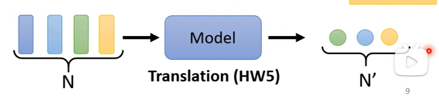

# self-attention（自注意力机制）

---

### Sophisticated Input

- Input is a vector
- Input is a set of vectors 

#### Vector Set as Input

（词汇，音频，图片.)

##### 怎么把一个词汇表示成一个向量呢？

- One-hot Encoding

  

- Word Embedding

  

##### 一段声音信号其实是一个向量

叫做一个Frame。25ms。

1s -> 100frames,1f分钟就有6000个向量。

##### Graph（图） is also  a set of vectors.(consider each node as a vector)

---

### What is the output?

- Each vector has a label.

  

  词性标注，音标标注，等。

  

- The whole Sequence has a label.

  

  情感分析，语者辨认，分子毒性预测，等

  

- Model decides the number of labels itself（Seq2Seq）

  

---

### Sequence  Labeling

如果是Fully-connected network，直接输入的花没办法识别saw和saw的区别。

正确的做法是把前后几个向量叠加起来：

但是还是有局限:

- It is possible to consider the context?

  FC can consider the neighbor

- How to consider the whole Sequence?

  - a window covers the whole sequence?

## SELF-ATTENTION

将一整个sequence输入。输入几个vector就输出几个vector，这四个vector考虑一整个sequence才得到的。

self-attention可以叠加很多次：

可以将fully connected和self-attention 交替使用。

 

#### Self-attention是怎么运作的呢？

self-attention的input是一串的vector。

self-attention的output是另一串的vector。

如何产生b1向量呢？

- step1：根据a1找出这个sequence里面跟a1相关的向量。每一个向量跟a的关联度以α表示。Find the relevant vectors in a sequence。

- step2：

  1. 方法一（常用）：Dot-product。向量乘以两个不同的矩阵得到q，k再把q，k相乘再相加得到α。

     

  2. 方法二：additive 

     

- Step3：

  - 

  -  

    

